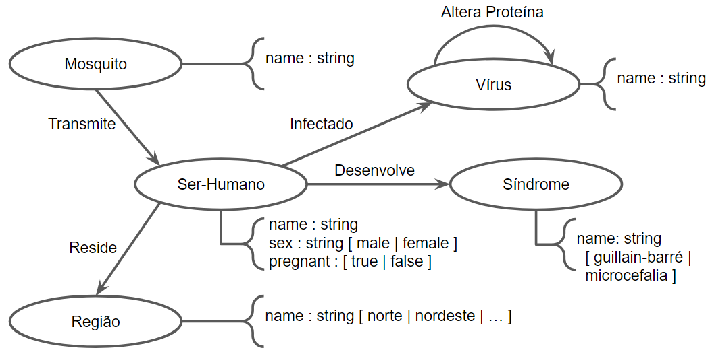

# Projeto: Zika vírus e suas implicações na saúde pública brasileira

# Project: Zika virus and its implications on brazilian public health

# Descrição Resumida do Projeto

Arboviroses são doenças causadas por vírus transmitidos por artrópodes. No Brasil existem mais de 200 arboviroses diferentes, sendo que 40 dessas doenças causam maiores complicações em seres humanos [1] e são classificadas como arboviroses emergentes, pois são causadas por vírus ainda restritos a determinadas regiões específicas do país.

O Zika vírus (ZIKV), detectado no Brasil em 2014 porém ainda sem causar grandes impactos, emergiu em 2015 se espalhando pelo país e causando uma série de complicações nas pessoas infectadas por ele. Em sua maioria complicações neurológicas. O principal problema em adultos foi a síndrome de Guillain Barré e em neonatos, a microcefalia. Ambas as manifestações clínicas são comprometedoras do ponto de vista do bem estar humano pois deixam sequelas irreversíveis afetando de forma significativa a vida da pessoa acometida por tais síndromes e o sistema público de saúde, uma vez que se torna necessário a criação de centros de reabilitação.

Visando-se evitar situações adversas como a pandemia da Sars-Cov-2 (2020) e a epidemia de Dengue (DENVs) em desenvolvimento atualmente no Brasil, observa-se a necessidade de se analisar em retrospecto a epidemia de ZIKV (2015-2017) dada a riqueza de dados de ômicas e o fato de essa epidemia ter causado grande impacto na saúde pública brasileira. Nesse projeto pretendemos avaliar a incidência de síndrome de Guillain Barré e microcefalia com relação às regiões administrativas do Brasil tal como avaliar como a interação patógeno-hospedeiro altera a expressão genética e como se desenvolve o quadro patológico decorrente da infecção viral.

# Fundamentação Teórica

- Vírus emergentes apresentam um potencial muito maior de desencadear doenças em humanos pelo fato da interação ser recente. [2]
- Vírus alteram a fisiologia de um organismo alterando toda a homeostase antes existente. [3] 
- Análise espacial da distribuição de microcefalia. [4]
- As implicações da Zika na saúde pública. [5]

# Perguntas de Pesquisa

Com base no sequenciamento do Zika vírus e dados epidemiológicos é possível gerar modelos de predição eficientes que ajudem na prevenção de doenças relacionadas a esse arbovírus?

# Bases de Dados

Base de dados | Endereço na web | Resumo descritivo
----- | ----- | -----
ACS - American Chemical Society | https://pubs.acs.org/action/doSearch?AllField=arbovirus | Informações científicas; Mais de 80 periódicos revisados 
BMC- BioMed Central | https://www.biomedcentral.com/about | Faz parte da Springer Nature;  BMC Biology, BMC Medicine,  Genome Biology, Genome Medicine  e BMC Global and Public Health.
PubMed | https://pubmed.ncbi.nlm.nih.gov | Base de dados com citações e resumos de literatura biomédica; links para conteúdo de texto completo do PubMed Central e de sites de editores.
NIH | https://www.ncbi.nlm.nih.gov | Repositório de sequenciamento de DNA e RNA e de artigos relacionados
Secretaria de Saúde do Recife/PE | http://dados.recife.pe.gov.br/it/dataset/casos-de-dengue-zika-e-chikungunya |Registro realizado de casos de Dengue, Zika e Chikungunya nas unidades de saúde, públicas ou particulares entre 2015 e 2021.

# Modelo Lógico

# Metodologia

Técnica de Ciência de redes
- Análise comunidades e centralidade (mas não limitado a estas)

Questões endereçadas a técnica
- Epidemiologia:
  - Tipo de doença, relacionada ao Zika virus (ZIKV), por região?
  - Incidência e aumento de tipo de doença, relacionada ao ZIKV, por região?
  - Fatores determinantes para um índice maior de um arbovírus específico?
  - Índice de transmissão de ZIKV em relação a outros arbovírus pelo Aedes aegypti?

- Ômicas:
  - Existem proteínas relacionadas à replicação viral?

# Ferramentas

- Neo4j
- Cytoscape
- Protégé
- Código Python

# Referências Bibliográficas

[1] FIGUEIREDO, L. T. M. Emergent arboviruses in Brazil. Revista da Sociedade Brasileira de Medicina Tropical, v. 40, n. 2, p. 224–229, 2007.

[2] Burrell CJ, Howard CR, Murphy FA. Emerging Virus Diseases. Fenner and White's Medical Virology. 2017;217-225. doi:10.1016/B978-0-12-375156-0.00015-1.

[3] Silva-Filho JL, de Oliveira LG, Monteiro L, Parise PL, Zanluqui NG, Polonio CM, de Freitas CL, Toledo-Teixeira DA, de Souza WM, Bittencourt N, Amorim MR, Forato J, Muraro SP, de Souza GF, Martini MC, Bispo-Dos-Santos K, Vieira A, Judice CC, Pastore GM, Amaral E, Passini Junior R, Mayer-Milanez HMBP, Ribeiro-do-Valle CC, Calil R, Renato Bennini Junior J, Lajos GJ, Altemani A, Nolasco da Silva MT, Carolina Coan A, Francisca Colella-Santos M, von Zuben APB, Vinolo MAR, Arns CW, Catharino RR, Costa ML, Angerami RN, Freitas ARR, Resende MR, Garcia MT, Luiza Moretti M, Renia L, Ng LFP, Rothlin CV, Costa FTM, Peron JPS, Proença-Modena JL. Gas6 drives Zika virus-induced neurological complications in humans and congenital syndrome in immunocompetent mice. Brain Behav Immun. 2021 Oct;97:260-274. doi: 10.1016/j.bbi.2021.08.008. Epub 2021 Aug 11. PMID: 34390806.

[4] Peiter PC, Pereira RDS, Nunes Moreira MC, et al. Zika epidemic and microcephaly in Brazil: Challenges for access to health care and promotion in three epidemic areas. PLoS One. 2020;15(7):e0235010. Published 2020 Jul 7. doi:10.1371/journal.pone.0235010.

[5] Lowe R, Barcellos C, Brasil P, et al. The Zika Virus Epidemic in Brazil: From Discovery to Future Implications. Int J Environ Res Public Health. 2018;15(1):96. Published 2018 Jan 9. doi:10.3390/ijerph15010096.

<!--

# P1 - Template da Primeira Entrega
*2024.1 Ciência e Visualização de Dados em Saúde*

# Estrutura de sua pasta de projeto

A fim de uniformizar os repositórios de projetos da disciplina, os diretórios de seu repositório deverão ser nomeados conforme segue.

Seu repositório deverá obrigatoriamente conter o arquivo `README.md`, arquivo de documentação Markdown, que deverá conter a descrição do projeto conforme orientações a seguir.

~~~
...
│
└── project1
    |
    ├── README.md   <- texto da Entrega 1 do projeto
    |
    └── assets      <- mídias usadas no projeto
        ├── images  <- imagens usadas no texto do README.md
        └── slides  <- slides da prévia (em PDF)
~~~

Na raiz da pasta `project1` deve haver um arquivo de nome `README.md` contendo a apresentação do projeto, como detalhado na seção seguinte.

Segue abaixo o modelo de como deve ser apresentado e documentado o projeto. Há partes do modelo a seguir que têm uma marcação específica indicando que **não devem ser literalmente transcritas**:

Trecho entre `<...>` representa algo que deve ser substituído pelo indicado. Nesse caso, você não deve manter os símbolos `<...>`.
> Parágrafo que aparece neste modo de citação representa algo que deve ser substituído pelo explicado.

No modelo a seguir são colocados exemplos ilustrativos, que serão substituídos pelos do seu projeto.

> # Modelo para Apresentação da Entrega 1 do Projeto (Arquivo README.md)

# Projeto `<Título em Português>`
# Project `<Title in English>`

# Descrição Resumida do Projeto

> Descrição do tema do projeto, incluindo motivação e contexto gerador.

# Fundamentação Teórica

> Fundamentação teórica resumida do problema em saúde/biologia. Apenas cite artigos que tomará como base e, em uma frase, em que problema.

# Perguntas de Pesquisa

> Perguntas de pesquisa que o projeto pretende responder ou hipóteses a serem avaliadas, enunciadas de maneira objetiva e verificável.

# Bases de Dados

> Elencar bases de dados candidatas a serem utilizadas no projeto na forma de tabela:

> Base de Dados | Endereço na Web | Resumo descritivo
> ----- | ----- | -----
> Título da Base 1 | http://base1.org/ | Breve resumo (duas ou três linhas) sobre a base.
> Título da Base 2 | http://base2.org/ | Breve resumo (duas ou três linhas) sobre a base.

# Modelo Lógico

> Modelo lógico da base de grafos que será construída. Para o modelo de grafos de propriedades, utilize este
> [modelo de base](https://docs.google.com/presentation/d/10RN7bDKUka_Ro2_41WyEE76Wxm4AioiJOrsh6BRY3Kk/edit?usp=sharing) para construir o seu.
> Coloque a imagem do PNG do seu modelo lógico como ilustrado abaixo (a imagem estará na pasta `image`):
>
> 

# Metodologia
> Esta seção evoluirá ao longo do projeto. Nesta primeira entrega, informe técnicas de Ciência de Redes que pretende explorar,
> tais como: detecção de comunidades, análise de centralidade, predição de links, ou a combinação de uma ou mais técnicas. Descreva o que perguntas pretende endereçar cm a técnica escolhida.

# Ferramentas

> Ferramentas a serem utilizadas (com base na visão atual do grupo sobre o projeto).

# Referências Bibliográficas

> Lista de artigos, links e referências bibliográficas.
>
> Fiquem à vontade para escolher o padrão de referenciamento preferido pelo grupo.

-->