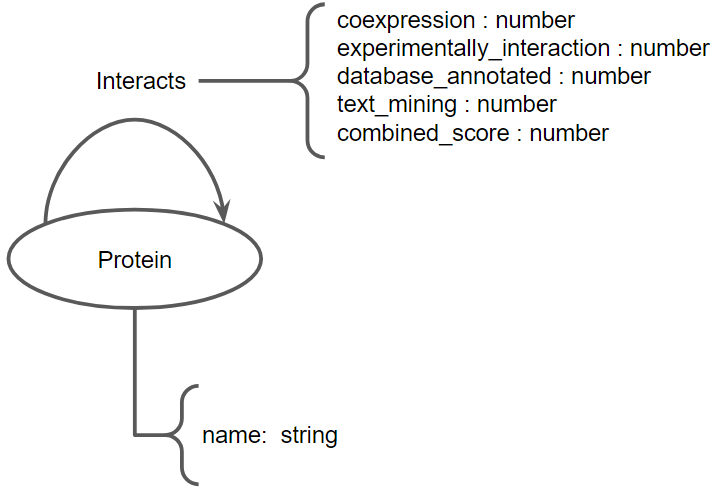

# Projeto: Como o Zika altera a fisiologia fetal desencadeando a microcefalia

# Project: How Zika alters fetal physiology, triggering microcephaly

# Descrição Resumida do Projeto

A epidemia de Zika vírus que acometeu o Brasil na década passada mostrou como os vírus emergentes podem desencadear problemas profundos na saúde pública. Atualmente o Brasil passa por um surto de um vírus emergente, o oropouche e uma epidemia de dengue. A recorrência de eventos com estes, evidenciam a importância de entendermos os mecanismos que os arbovírus usam para causarem tais doenças.

Em relação ao Zika vírus (ZIKV), vimos como ele causou problemas no Brasil, não só em adultos com a síndrome de Guillain Barré, mas também em neonatos com microcefalia.

O foco deste projeto compreende analisar a microcefalia, visto que é algo que afeta dois organismos, sendo um desenvolvido (a mulher) e o outro em desenvolvimento (o feto). Para isso, analisamos dados de RNAseq de células tronco neuronais com o intuito de avaliar a expressão diferencial de genes na presença de duas linhagens de ZIKV, a saber: de origem Polinésio e Uganda.

# Slides

- Os slides utilizados na apresentação da entrega 2 estão disponíveis [aqui](assets/slides/projeto-final-entrega-2.pdf).
- Este relatório também está disponível para download em formato PDF [aqui](assets/misc/projeto-final-entrega-2_report.pdf).

# Fundamentação Teórica

Doenças emergentes geralmente são negligenciadas, e no caso do zika (ZIKV) não foi diferente. Tal fato é agravado tendo em vista que há muito tempo ZIKV já circulava na África (2). Mas foi somente quando a variante da Polinésia chegou ao Brasil que estudos com esse vírus se intensificaram (5), sendo que, por meio do SUS (8), especificamente na medicina da família, se observou um aumento expressivo de casos de microcefalia. Infecções virais tendem a alterar um organismo de maneira pontual, como os rinovírus (7) que acabam por infectar principalmente as vias aéreas superiores. Porém, existem outros vírus que atuam sistematicamente alterando toda a fisiologia do organismo.

Existem vários vírus que alteram sistematicamente a homeostase de um organismo, como por exemplo o vírus Sars-cov-2 que embora seja um vírus respiratório, ele consegue afetar células do sistema nervoso (6), comprometendo assim, outros sistemas biológicos do organismo. Sabendo disso, e com base no que sabemos do ZIKV, procuramos entender como este vírus afeta o desenvolvimento do sistema nervoso dos fetos que tiveram suas genitoras infectadas por ZIKV.

# Perguntas de Pesquisa

1. Existem proteínas relacionadas à replicação viral? 
Sim. Existem proteínas não estruturais com a RpRd (RNA polimerase dependente de RNA) NS5 viral; este tipo de proteína aumenta a virulência principalmente na linhagem de Uganda. Na linhagem da polinésia ou asiática, essa NS não apresenta uma alta atividade, o que foi  demonstrado no estudo (4) que utilizamos para obter o RNA seq. Para este vírus observamos que o aumento da replicação viral implica em um aumento do dano no tecido nervoso in vitro.

2. Quais células imunes e tipos de expressão o Zika afeta?
3. O Zika vírus tem uma maior influência em qual via do sistema imune ?
4. Como um organismo invasor (exógeno) consegue alterar toda uma cadeia de expressão gênica?
5. Como o vírus Zika altera a produção de proteínas em organismos ou células infectadas?
6. Qual a dinâmica viral que resulta na microcefalia?

# Metodologia

O trabalho teve por objetivo, de forma exploratória, apresentar a relação entre os achados e o desenvolvimento da síndrome de microcefalia, através de técnicas de ciência de redes. A princípio, apresenta-se uma análise temporal da agressividade do vírus nas variantes em estudo (Polinésia e Uganda). A análise foi realizada através da plataforma GEO. Em um segundo momento, observa-se a geração de uma rede de vias de expressão gênica enriquecidas com nós representando genes potencialmente associados a tais vias, com o auxílio do aplicativo Cytoscape.

Apresenta-se então o cálculo de uma medida de centralidade (Betweenness Centrality) para cada nó, sendo tal medida associada graficamente através do tamanho e coloração dos nós. Além do mais, são identificadas as vias mais importantes (vias de expressão mais ativadas), com base na medida de centralidade, além dos genes hubs (genes mais evidentes) associados às vias. Comunidades presentes nessa rede são evidenciadas através do algoritmo Cyfinder, possibilitando então a interpretação biológica dos achados.

Em seguida, pretende-se criar redes de interação Proteína-Proteína usando uma pesquisa no website String tendo por base os genes mais expressos encontrados no estudo anterior de vias enriquecidas. Com tais informações pretende-se utilizar o Neo4J para juntar tal rede com Pathways característicos da síndrome de microcefalia. Por fim, a rede gerada será exportada para análises finais no Cytoscape.

## Bases de Dados e Evolução

Base de Dados | Endereço na Web | Resumo descritivo
----- | ----- | -----
GEO | https://www.ncbi.nlm.nih.gov/geo | É um repositório que arquiva e distribui microarrays, sequenciamento de próxima geração e outras formas de dados genômicos funcionais de alto rendimento.
STRING | https://string-db.org | É um banco de dados biológico, um recurso de interações proteína-proteína conhecidas e previstas. Contém informações de várias fontes; dados experimentais, métodos de previsão computacional e coleções de textos públicos.
KEGG Pathway | https://www.genome.jp/kegg/pathway.html | É uma coleção de mapas de caminhos desenhados manualmente que representam nosso conhecimento das redes de interação, reação e relação molecular: Metabolismo; Processamento de informações genéticas e ambientais; Processos celulares; Sistemas orgânicos; Doenças humanas e desenvolvimento de drogas.  
MSigDB | https://www.gsea-msigdb.org/gsea/msigdb | O Banco de Dados de Assinaturas Moleculares (MSigDB) é um recurso de dezenas de milhares de conjuntos de genes anotados para uso com software GSEA, divididos em coleções de Humanos e Ratos.

## Modelo Lógico

Até o momento foram utilizados dois modelos lógicos no desenvolvimento do projeto.

### Modelo lógico de rede de vias enriquecidas

### Modelo lógico de rede de interação Proteína-Proteína

## Integração entre Bases

Os dados baixados do GEO foram juntados em código Python para se ter uma fonte de dados adequada para a montagem de uma rede de vias enriquecidas. Foi necessário a realização de tratamento de dados faltante nos arquivos baixados. Ao cruzar os dados, alguns registros assumiram valores nulos e por isso foi necessário sua remoção.

## Análise Preliminar

### Análise cinética da expressão diferencial genética

Foram utilizados dados referentes ao projeto _**[GSE157530](https://www.ncbi.nlm.nih.gov/geo/query/acc.cgi?acc=GSE157530) Impact of Zika Virus Infection on Human Neural Stem Cell MicroRNA Signatures [array]**_ disponível na base de dados GEO sendo divididos e analisados em 3 grupos diferentes:

- amostras de ZIKV French Polynesia
- amostras de ZIKV Uganda
- amostras de controle

Os grupos de amostras analisadas, foram ainda divididos em subgrupos referentes aos respectivos estágios de infecção: 24, 48 e 72 horas após a infecção. Assim, após a identificação dos subgrupos, foi realizada uma análise preliminar com utilização da ferramenta GEO2R embarcada no próprio website do repositório de dados. Alguns achados importantes foram identificados com é possível notar nas análises que se seguem.

Os gráficos a seguir apresentam a evolução do grau de proximidade das amostras ao longo do tempo, evidenciando que o desenvolvimento da doença traz à tona características comuns às amostras dos mesmos subgrupos tornando-as assim, mais próximas.

Os gráficos a seguir corroboram a análise anterior revelando o aumento na quantidade de genes expressos diferencialmente em comum entre os grupos nos cruzamentos realizados:

E revelando assim, a agressividade de ambas as variantes do vírus conforme exibido na figura seguinte:

Nota: no gráfico acima as amostras na primeira linha da tabela referem-se às análises ZIKV vs POL e na segunda linha às análises ZIKV vs UGD.

A seguir é mostrada a rede gerada após a realização da análise de vias enriquecidas com a ferramenta GSEApy a partir dos genes com maior expressão identificados na análise de 72h do experimento ZIKV vs POL.

E abaixo segue a relação dos nós com maior Betweenness Centrality:

A partir dessa rede foi possível identificar algumas vias com maior importância, bem como a identificação de algumas comunidades conforme mostrado na figura a seguir.

### Análise e interpretação biológica

É possível se observar na rede e nas comunidades a presença de expressão de genes, no caso proteínas, relacionadas à via de reconhecimento de patógenos que comumente é conhecido como complexo de histocompatibilidade (MHC) em modelos murinos e HLA em humanos. Os HLAs que vemos que são de maior importância no caso são os A, B e C. Principalmente pelo fato de eles ativarem a via de linfócitos T citotóxicos (CD8). A ativação de tal via desencadeia a morte celular programada das células que forem reconhecidas por padrões de infecção viral. Isso geralmente é encontrado pela expressão de genes relacionados a interferon como os IRFs, e na rede, conseguimos observar o IRF 1 por exemplo. Além disso, por estarmos vendo a ativação dos HLAs de ativação de CD8 citotóxica vemos a presença de proteínas relacionadas a apoptose que são a RIPK2, a qual apresenta 7 interações, e o TNF-alfa, relacionado a necrose.

Tais interações podem mediar o caminho ao qual leva a morte de células tronco cerebrais mostrando como que a infecção por ZIKA apresenta um tropismo maior para a morte de tecido nervoso. Podendo assim elucidar melhor quais são as outras proteínas que vão interagir com a RIPK 2 que vão promover uma morte massiva de células do sistema nervoso.

## Evolução do Projeto

- Evoluir e melhorar as análises iniciadas;
- Construir rede de interação PPI (String + Neo4J + Cytoscape + Pathway de microcefalia);
- Analisar a diferença entre pacientes com microcefalia e os outros com zika+microcefalia.

# Ferramentas

- GEO2R
- Código Python
- GSEApy
- Neo4j
- Cytoscape
- Orange

# Referências Bibliográficas

1. Jung HG, Cho H, Kim M, et al. Influence of Zika virus 3'-end sequence and nonstructural protein evolution on the viral replication competence and virulence. Emerg Microbes Infect. 2022;11(1):2447-2465. doi:10.1080/22221751.2022.2128433(Artigo da NS5)
2. DICK GW, HADDOW AJ. Uganda S virus; a hitherto unrecorded virus isolated from mosquitoes in Uganda. I. Isolation and pathogenicity. Trans R Soc Trop Med Hyg. 1952 Nov;46(6):600-18. doi: 10.1016/0035-9203(52)90021-7. PMID: 13005679.(artigo da origem do zika )
3. Lottini G, Baggiani M, Chesi G, et al. Zika virus induces FOXG1 nuclear displacement and downregulation in human neural progenitors. Stem Cell Reports. 2022;17(7):1683-1698. doi:10.1016/j.stemcr.2022.05.008
4. Tabari D, Scholl C, Steffens M, et al. Impact of Zika Virus Infection on Human Neural Stem Cell MicroRNA Signatures. Viruses. 2020;12(11):1219. Published 2020 Oct 27. doi:10.3390/v12111219
5. Lowe R, Barcellos C, Brasil P, et al. The Zika Virus Epidemic in Brazil: From Discovery to Future Implications. Int J Environ Res Public Health. 2018;15(1):96. Published 2018 Jan 9. doi:10.3390/ijerph15010096
6. Beckman D, Bonillas A, Diniz GB, et al. SARS-CoV-2 infects neurons and induces neuroinflammation in a non-human primate model of COVID-19. Cell Rep. 2022;41(5):111573. doi:10.1016/j.celrep.2022.111573
7. Blaas D, Fuchs R. Mechanism of human rhinovirus infections. Mol Cell Pediatr. 2016;3(1):21. doi:10.1186/s40348-016-0049-3
8. GADELHA, Paulo; LIMA, Nísia Trindade; RANGEL, Valcler; STABELI, Rodrigo Guerino. The role of the Brazilian Unified System of Health (SUS) and the contributions in response to the Zika Virus outbreak. Policy in Focus, v. 13, n. 1, p. 23-26, 2016.