# Projeto - Como o Zika altera a fisiologia fetal desencadeando a microcefalia

# Project - How Zika alters fetal physiology, triggering microcephaly

# Descrição Resumida do Projeto

A epidemia de Zika vírus que acometeu o Brasil na década passada mostrou como os vírus emergentes podem desencadear problemas profundos na saúde pública. Atualmente o Brasil passa por um surto de um vírus emergente, o oropouche e uma epidemia de dengue. A recorrência de eventos como estes, evidenciam a importância de entendermos os mecanismos que os arbovírus usam para causarem tais doenças.

Em relação ao Zika vírus (ZIKV), vimos como ele causou problemas no Brasil, não só em adultos com a síndrome de Guillain Barré, mas também em neonatos com microcefalia.

O foco deste projeto compreende analisar a microcefalia, visto que é algo que afeta dois organismos, sendo um desenvolvido (a mulher) e o outro em desenvolvimento (o feto). Para isso, analisamos dados de RNAseq de células tronco neuronais com o intuito de avaliar a expressão diferencial de genes na presença de duas linhagens de Zika: a africana (Uganda) e a asiática (Polinésia) .Contudo focamos na análise da microcefalia. 

# Slides

- Os slides utilizados na apresentação da entrega 3 estão disponíveis [aqui](assets/slides/projeto-final-entrega-3.pdf).
- Este relatório também está disponível para download em formato PDF [aqui](assets/misc/projeto-final-entrega-3_report.pdf).

# Fundamentação Teórica

Doenças emergentes geralmente são negligenciadas, e no caso do zika (ZIKV) não foi diferente. Tal fato é agravado tendo em vista que o ZIKV, há muito tempo,  já circulava na África (2). Mas foi somente quando a variante da Polinésia chegou ao Brasil que estudos com esse vírus se intensificaram (5), sendo que, por meio do SUS (8), especificamente na medicina da família, se observou um aumento expressivo de casos de microcefalia. Infecções virais tendem a alterar um organismo de maneira pontual, como os rinovírus (7) que acabam por infectar principalmente as vias aéreas superiores. Porém, existem outros vírus que atuam sistematicamente alterando toda a fisiologia do organismo.

Existem vários vírus que alteram sistematicamente a homeostase de um organismo, como por exemplo o vírus Sars-cov-2 que embora seja um vírus respiratório, ele consegue afetar células do sistema nervoso (6), comprometendo assim, outros sistemas biológicos do organismo. Sabendo disso, e com base no que sabemos do ZIKV, procuramos entender como este vírus afeta o desenvolvimento do sistema nervoso dos fetos que tiveram suas genitoras infectadas por ZIKV.

# Perguntas de Pesquisa

1. Quais células do sistema imune passam por alteração no momento da infecção e como isso afeta a expressão de citocinas?
2. Quais proteínas da formação de tecido nervoso são alteradas durante a infecção por zika?
3. Existem diferenças entre as variantes de zika? Como isso explicaria a microcefalia no Brasil?

# Metodologia

O trabalho teve por objetivo, de forma exploratória, apresentar a relação entre os achados e o desenvolvimento da síndrome de microcefalia, através de técnicas de ciência de redes. A princípio, apresenta-se uma análise temporal da agressividade do vírus nas variantes em estudo (Polinésia e Uganda). A análise foi realizada através da plataforma GEO. Em um segundo momento, observa-se a geração de uma rede de vias de expressão gênica enriquecidas com nós representando genes potencialmente associados a tais vias, com o auxílio do aplicativo Cytoscape.

Apresenta-se então o cálculo de uma medida de centralidade (Betweenness Centrality) para cada nó, sendo tal medida associada graficamente através do tamanho e coloração dos nós. Além do mais, são identificadas as vias mais importantes (vias de expressão mais ativadas), com base na medida de centralidade, além dos genes hubs (genes mais evidentes) associados às vias. Comunidades presentes nessa rede são evidenciadas através do algoritmo Cyfinder, possibilitando então a interpretação biológica dos achados.

Finalmente, uma rede de interação Proteína-Proteína (PPI) foi gerada, usando uma pesquisa no website String, tendo por base os genes mais expressos encontrados no estudo anterior. Através do aplicativo Orange efetuou-se o filtro de genes comuns com a primeira rede gerada (expressão gênica diferencial) e assim, utilizou-se o aplicativo Neo4J para juntar tal rede com a rede de genes associados à síndrome de microcefalia. Por fim, a rede gerada é analisada através do aplicativo Cytoscape, evidenciando a interpretação dos achados.

## Ferramentas

- GEO2R
- Código Python
- GSEApy
- Neo4j
- Cytoscape
- Orange

## Bases de Dados e Evolução

Base de Dados | Endereço na Web | Resumo descritivo
----- | ----- | -----
GEO | https://www.ncbi.nlm.nih.gov/geo | É um repositório que arquiva e distribui microarrays, sequenciamento de próxima geração e outras formas de dados genômicos funcionais de alto rendimento.
STRING | https://string-db.org | É um banco de dados biológico, um recurso de interações proteína-proteína conhecidas e previstas. Contém informações de várias fontes; dados experimentais, métodos de previsão computacional e coleções de textos públicos.
KEGG Pathway | https://www.genome.jp/kegg/pathway.html | É uma coleção de mapas de caminhos desenhados manualmente que representam nosso conhecimento das redes de interação, reação e relação molecular: Metabolismo; Processamento de informações genéticas e ambientais; Processos celulares; Sistemas orgânicos; Doenças humanas e desenvolvimento de drogas.  
MSigDB | https://www.gsea-msigdb.org/gsea/msigdb | O Banco de Dados de Assinaturas Moleculares (MSigDB) é um recurso de dezenas de milhares de conjuntos de genes anotados para uso com software GSEA, divididos em coleções de Humanos e Ratos.

## Modelo Lógico

Foram utilizados dois modelos lógicos no desenvolvimento do projeto.

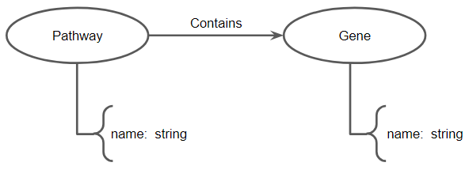

Figura 1: Modelo lógico de rede de vias enriquecidas

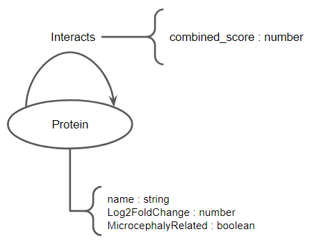

Figura 2: Modelo lógico de rede de interação Proteína-Proteína

## Integração entre Bases

Os dados baixados do GEO foram juntados em código Python para se ter uma fonte de dados adequada para a montagem de uma rede de vias enriquecidas. Foi necessário a realização de tratamento de dados faltante nos arquivos baixados. Ao cruzar os dados, alguns registros assumiram valores nulos e por isso foi necessário sua remoção.

# Análise Tecnológica

A seguir serão detalhados os procedimentos realizados para geração dos achados tecnológicos entregues ao final deste trabalho.

## Análise cinética da expressão diferencial genética

Foram utilizados dados referentes ao projeto _[GSE157530](https://www.ncbi.nlm.nih.gov/geo/query/acc.cgi?acc=GSE157530) Impact of Zika Virus Infection on Human Neural Stem Cell MicroRNA Signatures [array]_ disponível na base de dados GEO sendo os mesmos divididos e analisados em 3 grupos diferentes:

- amostras de ZIKV French Polynesia
- amostras de ZIKV Uganda
- amostras de controle

Os grupos de amostras analisadas, foram ainda divididos em subgrupos referentes aos respectivos estágios de infecção: 24, 48 e 72 horas após a infecção. Assim, após a identificação dos subgrupos, foi realizada uma análise preliminar com utilização da ferramenta GEO2R embarcada no próprio website do repositório de dados. Alguns achados importantes foram identificados e serão discutidos a seguir.

A figura 3 apresenta a evolução do grau de proximidade das amostras ao longo do tempo, evidenciando que o desenvolvimento da doença traz à tona características comuns às amostras dos mesmos subgrupos tornando-as assim, mais próximas.

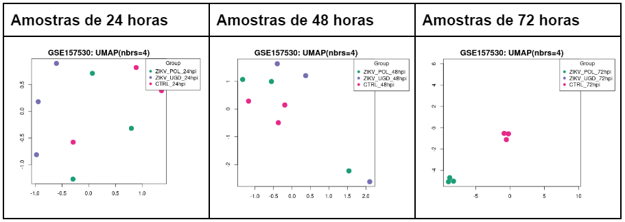

Figura 3: Evolução do agrupamento das amostras ao longo do tempo.

A figura 4 corrobora a análise anterior revelando o aumento da concentração de genes expressos diferencialmente em comum entre os grupos nos cruzamentos realizados conforme é possível notar em cada um dos grupos nos diagramas de Venn.

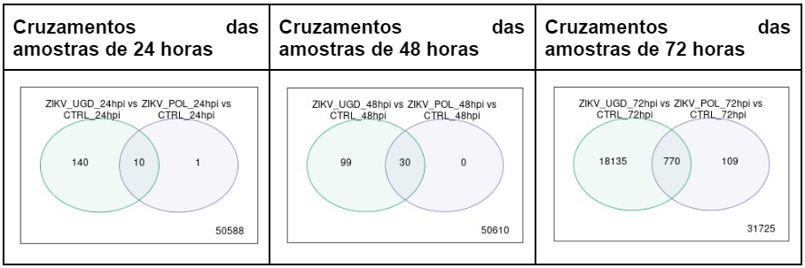

Figura 4: Evolução do cruzamento entre os grupos ao longo do tempo.

Vale notar que em ambas análises anteriores o conjunto de genes estudados manteve-se o mesmo (50739 genes) nos três momentos e em cada grupo.

Em seguida, a figura 5 revela a agressividade de ambas as variantes do vírus conforme é possível notar pela análise gráfica ao longo do tempo. A primeira linha da tabela refere-se às análises ZIKV POL vs CTRL enquanto a segunda linha às análises ZIKV UGD  vs CTRL.

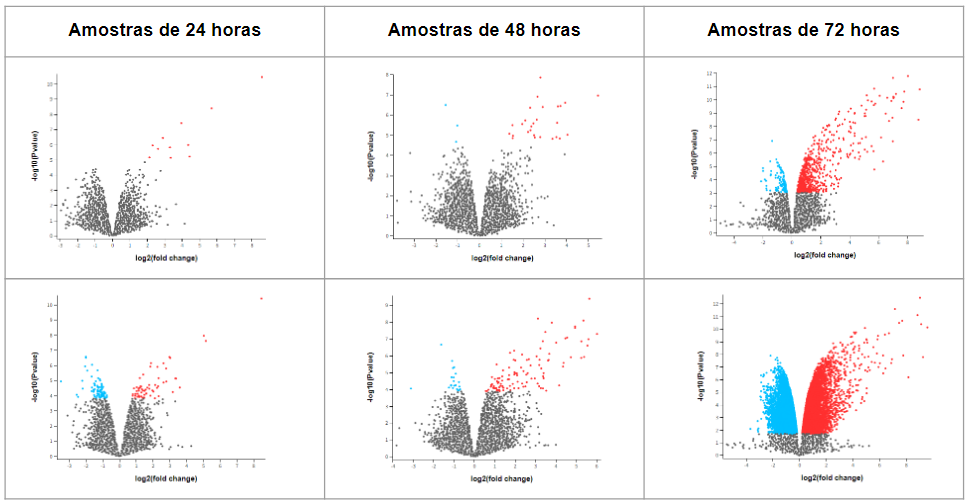

Figura 5: Gráficos de vulcão evidenciando a agressividade das variantes ao longo do tempo.

É possível notar o grande aumento de expressão gênica diferencial especialmente na análise da variante Uganda, contudo deste ponto em diante, focaremos nossa análise na variante French Polynesia uma vez que esta foi a variante responsável pela epidemia 2015-2017.

As análises realizadas no GEO2R fornecem arquivos fontes ([ZIKV_POL_vs_CTRL_72hpi.tsv](data/raw/ZIKV_POL_vs_CTRL_72hpi.tsv) e [ZIKV_all_genes_72hpi.tsv](data/raw/ZIKV_all_genes_72hpi.tsv)) com os genes e respectivas expressões diferenciais (up:vermelho e down:azul) que futuramente servirá para colorir os nós das redes no Cytoscape.

## Análise de rede de vias enriquecidas

A seguir, é apresentada a rede gerada (figura 6), após o procedimento de enriquecimento de vias, com a ferramenta GSEApy, a partir dos genes com maior expressão, identificados na análise de 72h do experimento ZIKV POL vs CTRL.

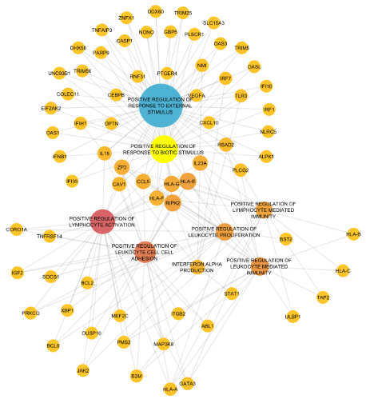

Figura 6: Rede de vias enriquecidas

E abaixo segue a relação dos nós com maior Betweenness Centrality:

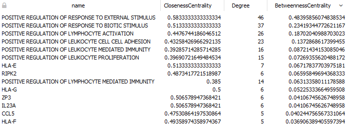

A partir dessa rede foi possível identificar algumas vias com maior importância, bem como a identificação de algumas comunidades conforme mostrado na figura 7 a seguir.

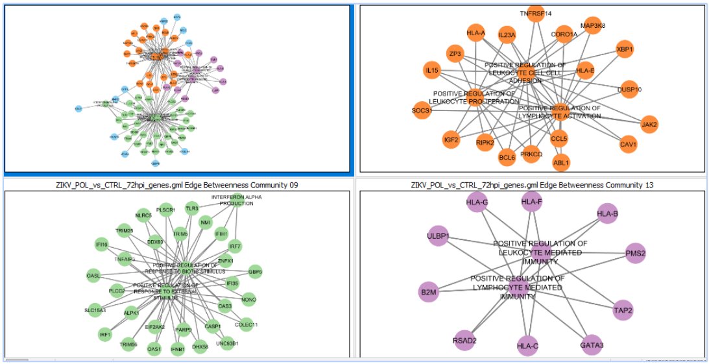

Figura 7: Comunidades da rede de vias enriquecidas

## Análise de rede de interação proteína-proteína

Para essa análise foram criadas duas redes de interação proteica. Uma relacionada aos genes diferencialmente expressos no experimento ZIKV POL vs CTRL de 72 horas e outra formada por genes comumente relacionados à microcefalia. A figura 8 mostra os genes encontrados na base String que estão relacionados à microcefalia e que fazem parte da rede formada no experimento ZIKV POL vs CTRL de 72 horas.

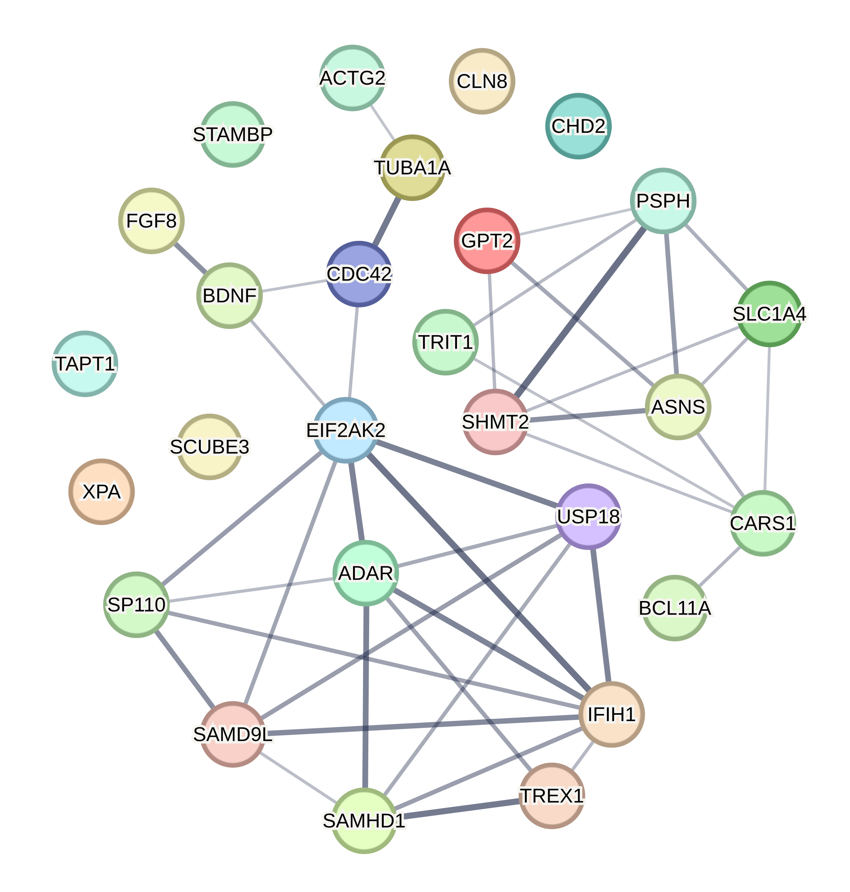
Figura 8: Genes associados à microcefalia

Por fim, após a sobreposição das redes citadas foi gerada uma rede de interação proteica final para análise do ponto de vista biológico. Essa rede é apresentada na figura 9 com nós de cor mais azulada (down regulados) e nós de cor mais avermelhada (up regulados).

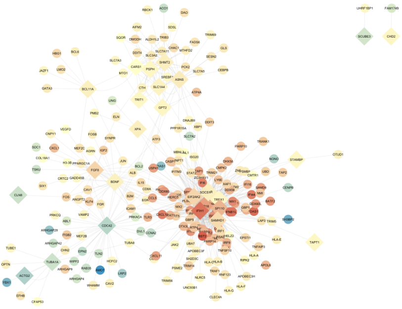
Figura 9: Rede final de expressão diferencial e genes associados à microcefalia

Detalhes quanto aos procedimentos para geração e junção das redes podem ser consultados no arquivo [README.md](src/README.md).

# Análise Biológica e Discussão

É possível observar na primeira rede de vias enriquecidas e nas comunidades (figura 6 e figura 7), a presença de expressão de genes (no caso proteínas), relacionadas à via de reconhecimento de patógenos que comumente é conhecido como complexo de histocompatibilidade (MHC), em modelos murinos e HLA em humanos. Os HLAs A, B e C que vemos, são  os de  maior importância, principalmente pelo fato de eles ativarem a via de linfócitos T citotóxicos (CD8). A ativação de tal via desencadeia a morte celular programada das células que forem reconhecidas por padrões de infecção viral. Isso geralmente é encontrado pela expressão de genes relacionados a interferon como os IRFs, por exemplo, conseguimos observar na rede o IRF 1. Além disso, por estarmos vendo a ativação de CD8 citotóxica pelos HLAs, observamos a presença de proteínas relacionadas a apoptose que são a RIPK2, a qual apresenta 7 interações, e o TNF-alfa, relacionado a necrose.

Tais interações podem mediar o caminho ao qual leva a morte de células tronco cerebrais, evidenciando como a infecção por ZIKA apresenta um maior tropismo para a morte de tecido nervoso; Podendo assim, elucidar melhor quais são as outras proteínas que irão interagir com a RIPK 2 e promover uma morte massiva de células do sistema nervoso.

Uma outra proteína que visualizamos, é a expressão de TLR3. Este tipo de proteína está relacionada de forma canônica ao reconhecimento de LPS (lipídio bacteriano), mas nos flavivírus  esse receptor apresenta uma ligação com NS1 (proteína não estrutural 1), no entanto, quando ocorre essa ligação a via apoptótica tende a ser ativada, desencadeando a morte celular. 

Na rede de interações proteína-proteína (figura 9) encontramos 6 ilhas de atração. Contudo, focamos naquelas ilhas que apresentavam relações com a diferenciação celular de tecido nervoso.

Observou-se que a via de TUBA1A (figura 10) está dow-regulada. Sendo que esta proteína, quando tem baixa atividade, desencadeia um tipo de microcefalia específica conhecida como lisencefalia 3.

TUBA1A: mutação ou down regulação causa microcefalia.

Log2FoldChange: -0.544.

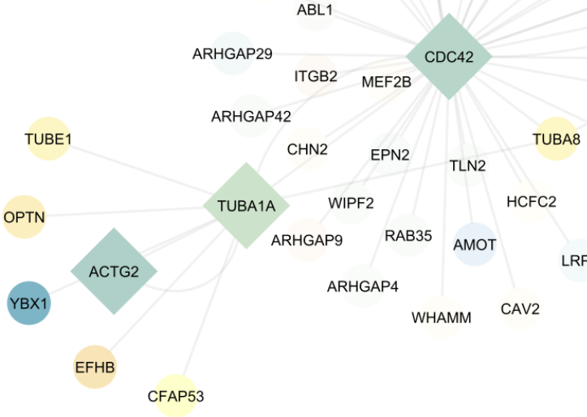

Figura 10: Ilhas de atração com diferenciação celular de tecido nervoso (TUBA1A)

Para a sobrevivência da célula é importante que ela apresente mecanismos de reparo , ou seja, que não seja facilmente induzida para a morte celular. É possível observar que a via CDC42 está dow-regulada (Log2FoldChange: -0.76)  demonstrando assim, que a via para a sobrevivência da célula pode estar sendo alterada (figura 11).

CDC42: sobrevivência celular.

Log2FoldChange: -0.76.

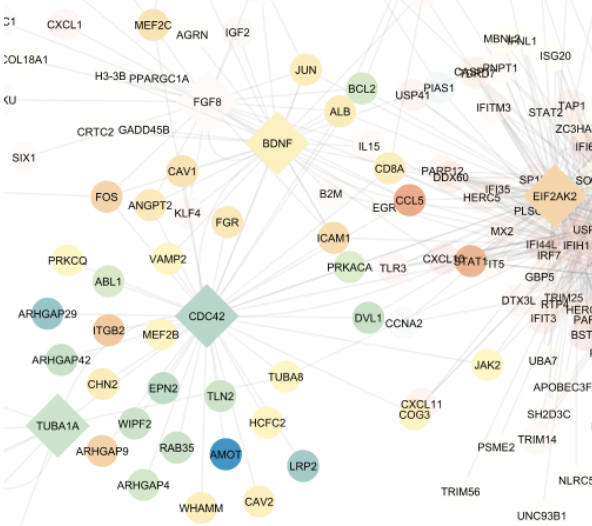

Figura 11: Ilhas de atração com diferenciação celular de tecido nervoso (CDC42)

Em contrapartida, observou-se que nesta outra ilha (figura 12), o FGF8 está up-regulado, sendo esta proteína relacionada a sobrevivência celular. Contudo o IL-15 está up-regulado, o qual é uma proteína pró-inflamatória. Geralmente quando citocinas pró-inflamatórias estão ativadas a via de apoptose está ativa.  

FGF8: sobrevivência celular.

Log2FoldChange: 2.232.

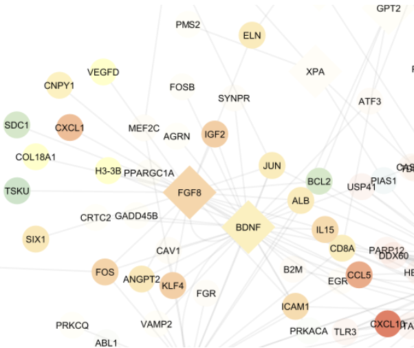

Figura 12: Ilhas de atração com diferenciação celular de tecido nervoso (FGF8)

Nesta outra ilha (figura 13) vemos que  a proteína BDNF está up-regulado, mas não chega no valor 1 do Log2 Fold Change. Isso mostra que esta proteína  está medianamente ativada; demonstra que o tecido nervoso pode estar suscetível à morte celular. 

BDNF: é um fator de sobrevivência de tecido nervoso.

Proteinas inflamatorias: IL15, CCL5.

Log2FoldChange: 0.811.

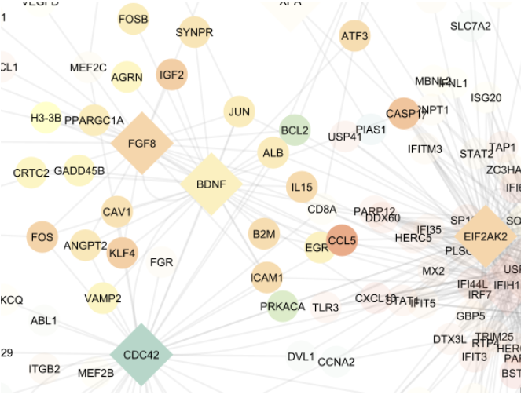

Figura 13: Ilhas de atração com diferenciação celular de tecido nervoso (BDNF)

# Conclusão

Elucidando questões de pesquisa.

1. Quais células do sistema imune passam por alteração no momento da infecção e como isso afeta a expressão de citocinas?

Na infecção por zika observamos, pela análise da figura 1, que os leucócitos (macrofagos, neutrófilos e monocitos) estão sendo ativados em conjunto com os linfócitos. Isso mostra que a via de resposta imune inata e adaptativa estão acontecendo; simultaneamente observamos a produção de citocinas pró- inflamatórias como IL-15 e a produção de IFN-alfa e fatores de regulação de interferon (IFRs) 

2. Quais proteínas da formação de tecido nervoso são alteradas durante a infecção por zika?

Vemos alteração nas proteínas relacionadas à formação de microtúbulos TUBA1A,  o qual está dow-regulado(-0,76), e ligado a CDC42 (relacionado a sobrevivência celular); simultaneamente vemos proteínas relacionadas à formação de vasos sanguíneos como AMOT dow-regulada (-1.994), não obstante, temos EPN2 que também está dow regulada (-0,666). Esta proteína geralmente é expressa no tálamo, porém é válido salientar que existem proteínas que estão relacionadas a sobrevivência celular e diferenciação celular, que estão up-reguladas como FGF8 e BDNF. Com isso observamos dois pontos:

Primeiro: as proteínas dow reguladas, que observamos, apresentam uma função importante na formação de estruturas celulares como microtúbulos, como em TUBA1A. Quando esta proteína está dow regulada acontecem casos de microcefalia sem infecção por zika, e no caso da presença da infecção, esta proteína apresenta baixa expressão.

Contudo, observamos que proteínas relacionadas à formação de vasos sanguíneos estão dow regulados, como é o caso de AMOT e EPN2. A baixa expressão destes tipos de proteínas impedem que ocorra a nutrição adequada para o desenvolvimento do tecido nervoso.

Segundo: Existem proteínas que permitem a sobrevivência celular e de tecido nervoso  que estão up reguladas, como é o caso de FGF8 e BDNF, respectivamente. Provavelmente são estes os fatores que permitem que a gestação prossiga e a genitora tenha a criança com microcefalia; pois o BDNF permite, minimamente, que o tecido nervoso consiga se desenvolver mesmo existindo a presença de citocinas pró-inflamatórias que desencadeiam morte celular como IL-15.
  
3. Existem diferenças entre as variantes de zika? Como isso explicaria a microcefalia no Brasil?

Sim, existem diferenças entre as variantes de uganda e polinésia. Sendo que, a variante de Uganda apresenta um efeito citopático muito elevado nas células tronco neuronais, conforme apresentado neste trabalho. Em contrapartida, o efeito citopático na variante da polinésia é menor. Isso  demonstra que o menor efeito citopático, visto in vitro, pode  dar mais viabilidade para o avanço da gestação, permitindo assim a presença de casos de microcefalia no Brasil relacionados à zika.

# Trabalhos Futuros e Evolução do Projeto

Como trabalhos futuros, espera-se continuar expandindo a rede, melhorando sua expressividade e interações gênicas, a fim de analisar a diferença entre pacientes com microcefalia e outros com microcefalia associada ao Zika.

# Referências Bibliográficas
1. Jung HG, Cho H, Kim M, et al. Influence of Zika virus 3'-end sequence and nonstructural protein evolution on the viral replication competence and virulence. Emerg Microbes Infect. 2022;11(1):2447-2465. doi:10.1080/22221751.2022.2128433(Artigo da NS5)
2. DICK GW, HADDOW AJ. Uganda S virus; a hitherto unrecorded virus isolated from mosquitoes in Uganda. I. Isolation and pathogenicity. Trans R Soc Trop Med Hyg. 1952 Nov;46(6):600-18. doi: 10.1016/0035-9203(52)90021-7. PMID: 13005679.(artigo da origem do zika )
3. Lottini G, Baggiani M, Chesi G, et al. Zika virus induces FOXG1 nuclear displacement and downregulation in human neural progenitors. Stem Cell Reports. 2022;17(7):1683-1698. doi:10.1016/j.stemcr.2022.05.008
4. Tabari D, Scholl C, Steffens M, et al. Impact of Zika Virus Infection on Human Neural Stem Cell MicroRNA Signatures. Viruses. 2020;12(11):1219. Published 2020 Oct 27. doi:10.3390/v12111219
5. Lowe R, Barcellos C, Brasil P, et al. The Zika Virus Epidemic in Brazil: From Discovery to Future Implications. Int J Environ Res Public Health. 2018;15(1):96. Published 2018 Jan 9. doi:10.3390/ijerph15010096
6. Beckman D, Bonillas A, Diniz GB, et al. SARS-CoV-2 infects neurons and induces neuroinflammation in a non-human primate model of COVID-19. Cell Rep. 2022;41(5):111573. doi:10.1016/j.celrep.2022.111573
7. Blaas D, Fuchs R. Mechanism of human rhinovirus infections. Mol Cell Pediatr. 2016;3(1):21. doi:10.1186/s40348-016-0049-3
8. GADELHA, Paulo; LIMA, Nísia Trindade; RANGEL, Valcler; STABELI, Rodrigo Guerino. The role of the Brazilian Unified System of Health (SUS) and the contributions in response to the Zika Virus outbreak. Policy in Focus, v. 13, n. 1, p. 23-26, 2016.